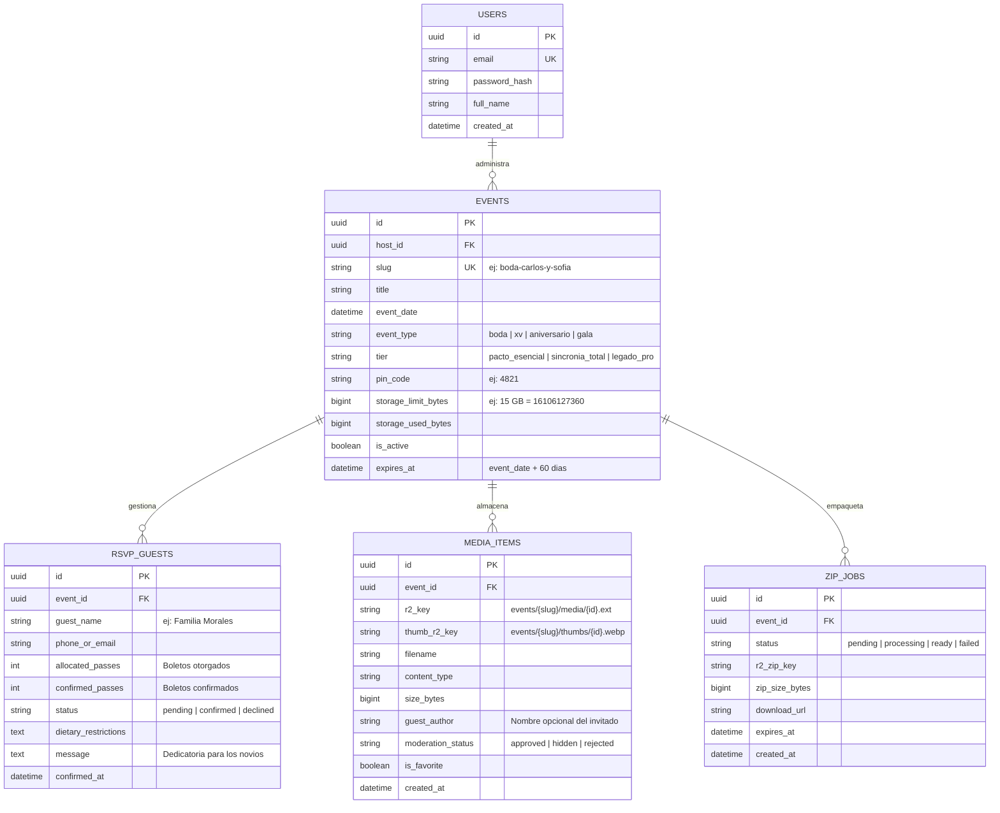

# Especificación Técnica y de Arquitectura: Vocatus & Animus
> **Documento Maestro de Arquitectura, Especificación de Datos y Hoja de Ruta para Desarrollo**  
> *Versión 1.0 — Suite Web para Eventos Sociales (Invitaciones RSVP + Bóveda Colaborativa de Recuerdos)*

---

## 1. Visión General del Producto

**Vocatus & Animus** es una suite de software (Micro-SaaS) concebida para digitalizar y simplificar el ciclo de vida completo de un evento social de alta gama (bodas, XV años, aniversarios, galas y graduaciones), bajo una línea estética minimalista, sobria y de alta usabilidad (*Industrial / Editorial Minimalist*).

El sistema se divide en dos módulos conceptuales complementarios pero técnicamente desacoplados:

1. **Vocatus ("El Llamado"):** Módulo pre-evento. Experiencia de invitación interactiva, logística del evento (itinerarios, GPS con Waze/Google Maps, código de vestimenta, mesa de regalos) y confirmación de asistencia inteligente (**RSVP**) con control de boletos.
2. **Animus ("La Memoria"):** Módulo en vivo y post-evento. Bóveda colaborativa de fotos y videos en calidad original, alimentada por los invitados en tiempo real sin necesidad de descargar apps ni crear cuentas (acceso por **QR + PIN de 4 dígitos** en centros de mesa). Incluye moderación en vivo, muro de proyección (*Live Wall*) y entrega de descarga masiva en **ZIP** antes de la purga programada de 60 días.

---

## 2. El Ciclo de Vida del Evento (User Journey)

```
┌──────────────────────────┐    ┌──────────────────────────┐    ┌──────────────────────────┐
│       FASE PREVIA        │    │    EL DÍA DEL EVENTO     │    │      FASE POSTERIOR      │
│         VOCATUS          │    │          ANIMUS          │    │          ANIMUS          │
├──────────────────────────┤    ├──────────────────────────┤    ├──────────────────────────┤
│ • Invitación interactiva │    │ • QR en centros de mesa  │    │ • Curaduría / Moderación │
│ • Confirmación RSVP      │    │ • Auto-login con PIN     │    │ • Empaquetado ZIP masivo │
│ • Itinerario y Mapas     │    │ • Carga directa a R2     │    │ • Entrega por correo     │
│ • Cuenta regresiva       │    │ • Muro social en vivo    │    │ • Purga a los 60 días    │
└──────────────────────────┘    └──────────────────────────┘    └──────────────────────────┘
```

### Transición Dinámica de Enlaces (Time-Aware Routing)
Para evitar que los anfitriones confundan a sus invitados enviando múltiples enlaces por WhatsApp, el sistema utiliza **enrutamiento consciente del tiempo**:
* **Antes del evento:** El link compartido (`/v/[evento-slug]`) exhibe la invitación, el mapa y el formulario de RSVP.
* **El día del evento:** La invitación muestra un banner festivo superior destacado: *"¡Hoy celebramos! Toca aquí para subir tus fotos y videos al muro de la fiesta"*, el cual enlaza a `/a/[evento-slug]`.
* **Durante la fiesta en físico:** El QR impreso en los centros de mesa lleva directo a la bóveda: `/a/[evento-slug]?pin=[PIN]`.
* **Días posteriores:** Al volver a entrar a `/v/[evento-slug]`, la interfaz muta automáticamente mostrando un agradecimiento y el botón directo para revivir la galería fotográfica del evento.

---

## 3. Pila Tecnológica y Topología de Infraestructura

| Capa | Tecnología Seleccionada | Justificación Técnica |
| :--- | :--- | :--- |
| **Arquitectura de Repositorio** | **Monorepo** (`apps/web` + `apps/api`) | Sincronización atómica de cambios de API y UI; despliegues independientes en CI/CD. |
| **Frontend de Invitados y Admin** | **Astro / Next.js + Tailwind CSS** | Serverless/Edge rendering para carga móvil instantánea (< 1 seg) con baja señal celular. |
| **Backend Core & Lógica de Negocio** | **FastAPI (Python 3.12)** | Asincronismo de alto rendimiento, validación nativa con Pydantic y firma criptográfica de S3. |
| **Base de Datos Principal** | **PostgreSQL 16** | Consistencia relacional estricta para eventos, boletos RSVP y metadatos de archivos. |
| **Almacenamiento de Objetos** | **Cloudflare R2** | Compatibilidad nativa con S3 API; **cero costos de egreso de datos ($0/GB egress)** y costo ultra accesible ($0.015/GB-mes). |
| **Procesamiento de Miniaturas** | **Híbrido (Client-side Canvas / Cloudflare Resizing)** | Cero sobrecarga de CPU en el servidor central durante picos de subida. |
| **Correos Transaccionales** | **Resend / Brevo API** | Envío de notificaciones de confirmación de asistencia y enlace de descarga del ZIP maestro. |
| **Entornos y Contenedores** | **Docker & Docker Compose** | Docker para Backend y Postgres; Frontend desplegado nativo en Vercel o Cloudflare Pages. |

---

## 4. Estructura del Monorepo

```text
vocatus-animus/
├── apps/
│   ├── web/                     # Aplicación Web (Frontend Edge)
│   │   ├── src/
│   │   │   ├── components/      # UI components (RSVPForm, PhotoUploader, LiveWall, etc.)
│   │   │   ├── pages/
│   │   │   │   ├── v/[slug].astro      # Módulo Vocatus: Invitación & RSVP
│   │   │   │   ├── a/[slug].astro      # Módulo Animus: Bóveda de Invitados
│   │   │   │   ├── live/[slug].astro   # Proyección Muro en Vivo (Live Wall)
│   │   │   │   └── admin/              # Panel de Control para Anfitriones
│   │   │   └── lib/             # API client, canvas-thumbnail generator
│   │   ├── tailwind.config.cjs
│   │   └── package.json
│   │
│   └── api/                     # Backend API (FastAPI)
│       ├── app/
│       │   ├── routers/
│       │   │   ├── events.py    # CRUD y configuración del evento
│       │   │   ├── rsvp.py      # Lógica de confirmación y pases
│       │   │   ├── vault.py     # Subida directa, batch-presigned, galería
│       │   │   ├── admin.py     # Moderación, métricas y trigger de ZIP
│       │   │   └── auth.py      # Login de anfitrión y validación de PIN
│       │   ├── services/
│       │   │   ├── storage.py   # Integración con Cloudflare R2 (boto3)
│       │   │   ├── mailer.py    # Servicio transaccional Resend
│       │   │   └── zip_packager.py # Generador asíncrono de ZIP
│       │   ├── models.py        # Modelos SQLAlchemy 2.0
│       │   ├── schemas.py       # Esquemas Pydantic v2
│       │   └── main.py
│       ├── Dockerfile           # Imagen Python optimizada
│       └── requirements.txt
│
├── docker-compose.yml           # Levanta Postgres + API localmente
├── .env.example
└── README.md
```

### Estrategia de Encapsulamiento con Docker
* **En Desarrollo Local:**
  * Base de datos: PostgreSQL 16 corriendo en Docker (`docker compose up -d db`).
  * Backend y Frontend: Corriendo de manera nativa (`uvicorn` y `bun/npm run dev`) para hot-reloading instantáneo.
* **En Producción:**
  * **Frontend:** Desplegado directamente en **Cloudflare Pages** o **Vercel** (Edge/CDN). **No requiere contenedor**, garantizando que los 200 invitados concurrentes no consuman memoria de tu servidor.
  * **Backend:** Empaquetado vía Docker (`apps/api/Dockerfile`) desplegable en **Fly.io, Railway, Render o VPS**.

---

## 5. Esquema de Base de Datos y Modelo de Dominio

La base de datos desacopla por completo la lógica de logística/invitados de los archivos multimedia mediante la entidad raíz `Event`.



---

## 6. Especificación de Mecanismos Técnicos Clave

### A. Subida Directa Cliente-a-Storage (Zero Server Load)
1. **Lote de URLs Prefirmadas (Batch Presigned):**
   * Durante la fiesta, el celular de un invitado sube 5 a 10 fotos a la vez. Para no saturar el backend con 10 peticiones HTTP individuales, el cliente envía:
     `POST /api/events/{slug}/batch-presigned` con el array de metadatos `[{filename, size_bytes, content_type}, ...]`.
   * El backend valida en una sola consulta:
     1. Que el evento esté activo y no haya expirado.
     2. Que el tamaño acumulado no supere `storage_limit_bytes`.
     3. Que el tipo MIME esté en lista blanca (`image/jpeg`, `image/png`, `image/webp`, `video/mp4`, `video/quicktime`).
     4. Límites por archivo: Máximo 25 MB por foto; 150 MB por video.
   * El backend genera las URLs prefirmadas de Cloudflare R2 con expiración de 5 minutos y las devuelve en una sola respuesta.
2. **Subida HTTP PUT Directa:**
   * El cliente ejecuta la subida en paralelo (concurrencia máxima de 2 o 3 archivos) directamente contra Cloudflare R2 vía `HTTP PUT`.
   * Al terminar cada subida exitosa, el cliente notifica al backend para asentar el registro en `MEDIA_ITEMS` e incrementar `storage_used_bytes`.

### B. Autenticación de Invitados Cero Fricción (QR + PIN de 4 Dígitos)
1. **Acceso Físico en Mesa:**
   * La tarjeta física en el centro de mesa contiene un QR con el PIN embebido:
     `https://tudominio.com/a/boda-carlos-y-sofia?pin=4821`
   * Si la cámara del móvil lee el link completo, la web extrae el parámetro `pin` y hace auto-login transparente.
   * Si el usuario entra escribiendo la URL a mano, una pantalla de diseño sobrio solicita el PIN de 4 dígitos (impreso en texto en la tarjeta).
2. **Emisión de JWT Efímero:**
   * Endpoint `POST /api/events/{slug}/enter` valida el PIN.
   * Si es correcto, emite un token JWT con vigencia de 24 horas y payload:
     `{"event_id": "...", "role": "guest", "exp": ...}`
   * Se almacena en `localStorage` del móvil para que el invitado pueda recargar la página durante toda la noche sin volver a autenticarse.

### C. Generación Ultrarrápida de Miniaturas (Thumbnails)
Para proyectar el muro en vivo y mostrar la galería sin descargar fotos originales de 15 MB:
* **Estrategia en Navegador del Invitado (Costo $0 de CPU):**
  * Antes de subir la foto original, un script en JavaScript mediante `OffscreenCanvas` genera una miniatura WebP de 400px en ~40 milisegundos en el celular del usuario.
  * El cliente solicita dos URLs prefirmadas por foto: una para el archivo original y otra para `thumb_{id}.webp`.
  * La galería del evento y el Live Wall consumen exclusivamente las miniaturas (pesan menos de 35 KB). El archivo original de alta resolución solo se utiliza para la vista en pantalla completa y el ZIP final.

### D. Empaquetado Asíncrono del ZIP Masivo (5 GB a 50 GB)
* Las descargas de 10 a 50 GB no pueden hacerse en la memoria del navegador ni en un pipe HTTP síncrono por límites de timeout y RAM.
* **Flujo Asíncrono:**
  1. El anfitrión da clic en *"Preparar descarga completa (ZIP)"* en su panel.
  2. El backend registra un `ZIP_JOB` en estado `processing`.
  3. Un proceso asíncrono (FastAPI `BackgroundTasks` o worker) transmite los archivos desde R2 usando un compresor de flujo (`zipstream-ng`) y canaliza el resultado mediante **S3 Multipart Upload** directo a R2 bajo la clave `events/{slug}/exports/recuerdos-completos.zip`.
  4. Una vez concluido, el job se marca como `ready` y se dispara un correo automático vía **Resend** con un enlace de descarga prefirmado de R2 con validez de 7 días.

### E. Purga Automática a los 60 Días (Sustentabilidad y Margen > 90%)
* En el bucket de Cloudflare R2 se establece una **Lifecycle Rule**:
  * Prefijo: `events/`
  * Acción: Eliminar objetos cuya antigüedad supere los 60 días tras la fecha del evento.
* Un cron diario ligero en el backend marca en la base de datos `is_active = false` en los eventos cumplidos sus 60 días naturales.

---

## 7. Paquetes Comerciales y Límites de Servicio

| Paquete | Alcance Vocatus | Alcance Animus | Cuota Storage | Retención |
| :--- | :--- | :--- | :---: | :---: |
| **Pacto Esencial** | Invitación digital interactiva + RSVP completo + Itinerario + GPS. | No incluido. | N/A | N/A |
| **Sincronía Total** | Invitación digital interactiva + RSVP completo. | Bóveda colaborativa (solo fotos) + QR/PIN de mesa + Descarga ZIP. | **15 GB** | 60 días |
| **Legado Pro** | Invitación digital + RSVP + Recordatorios por correo. | Bóveda completa (fotos y video corto hasta 60s) + Muro en Vivo (Live Wall) + Descarga ZIP. | **50 GB** | 60 días |

---

## 8. Contratos de API Principales (Borrador OpenAPI)

### Módulo Vocatus (RSVP & Invitación)
* `GET /api/v/{slug}` — Devuelve metadatos públicos de la invitación (nombres, fecha, itinerario, ubicación, mesa de regalos).
* `POST /api/v/{slug}/rsvp` — Registro o confirmación de asistencia por parte del invitado.
  * *Body:* `{ "guest_name": "...", "confirmed_passes": 2, "dietary_restrictions": "...", "message": "..." }`

### Módulo Animus (Bóveda & Media)
* `POST /api/a/{slug}/enter` — Valida el PIN de mesa de 4 dígitos y devuelve el JWT de invitado.
  * *Body:* `{ "pin": "4821" }`
* `POST /api/a/{slug}/batch-presigned` — Solicita URLs de subida directa a R2. *(Requiere Guest JWT)*
  * *Body:* `[{ "filename": "IMG_001.jpg", "size_bytes": 4500120, "content_type": "image/jpeg" }]`
* `POST /api/a/{slug}/media/confirm` — Notifica la subida exitosa para asentar el recurso en la base de datos.
* `GET /api/a/{slug}/feed` — Lista fotos aprobadas para la galería móvil o el Live Wall.

### Módulo de Administración (Anfitriones)
* `GET /api/admin/events/{slug}/dashboard` — Métricas de confirmados RSVP y porcentaje de almacenamiento ocupado.
* `PATCH /api/admin/media/{id}/moderate` — Cambia el estado a `approved`, `hidden` o `rejected`.
* `POST /api/admin/events/{slug}/request-zip` — Dispara el proceso de empaquetado ZIP en segundo plano.

---

## 9. Hoja de Ruta de Implementación (Roadmap para la IA / Desarrollador)

* [ ] **Paso 1: Inicialización del Monorepo**  
  Crear estructura de carpetas `apps/web` y `apps/api`. Configurar `docker-compose.yml` con PostgreSQL 16 y variables de entorno (`DATABASE_URL`, `R2_BUCKET_NAME`, `R2_ACCESS_KEY_ID`, `R2_SECRET_ACCESS_KEY`, `RESEND_API_KEY`).
* [ ] **Paso 2: Modelado de Datos y Migraciones**  
  Implementar modelos SQLAlchemy (`Event`, `RSVPGuest`, `MediaItem`, `ZipJob`) y generar tablas con soporte de UUID.
* [ ] **Paso 3: Core API de Vocatus (RSVP)**  
  Crear endpoints para consulta de invitación pública y recepción de confirmaciones de asistencia con conteo de pases.
* [ ] **Paso 4: Core API de Animus (Subida R2 y Validación por PIN)**  
  Implementar validación de PIN de 4 dígitos, servicio de firma S3 v4 para Cloudflare R2 con validación estricta de cuotas y tipos MIME.
* [ ] **Paso 5: Frontend de Invitados (Mobile-First)**  
  Construir la pantalla de bienvenida `/v/[slug]` y la interfaz de carga para mesa `/a/[slug]` con selector múltiple de fotos y generación de miniaturas en cliente (`OffscreenCanvas`).
* [ ] **Paso 6: Muro Social en Vivo (Live Wall)**  
  Vista de proyección en pantalla completa `/live/[slug]` con refresco automático de imágenes aprobadas.
* [ ] **Paso 7: Empaquetador Asíncrono de ZIP y Notificación**  
  Implementar el worker de empaquetado masivo en segundo plano hacia R2 y disparo de correo con enlace de descarga vía Resend.
* [ ] **Paso 8: Panel de Control de Anfitriones y Generador de Plantillas QR**  
  Dashboard con métricas de confirmados, moderación visual de recuerdos y botón para descargar/imprimir tarjetas de mesa con QR y PIN.
